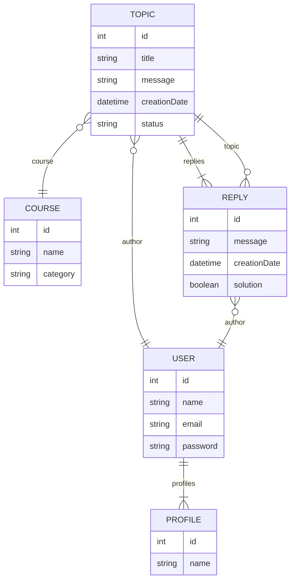
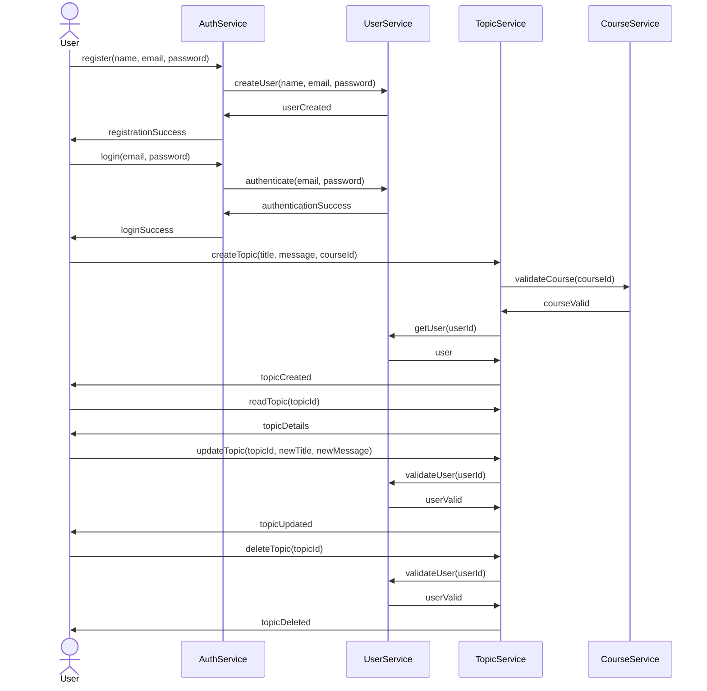

# Oracle One Forum Hub Challenger - Spring Boot

## Table of Contents
- [Introduction](#introduction)
- [Features](#features)
- [Diagrams](#diagrams)
  - [Entity Relationship Diagram](#entity-relationship-diagram)
  - [Sequence Diagram](#sequence-diagram)
- [Prerequisites](#prerequisites)
- [Installation](#installation)
- [Usage](#usage)
- [Configuration](#configuration)
- [Running Tests](#running-tests)
- [Contributing](#contributing)
- [License](#license)
- [Contact](#contact)

## Introduction
The Oracle One Forum Hub Challenger is a Spring Boot application designed to serve as a forum hub. This project is a challenge by Oracle aimed at fostering learning and development among developers. The application allows users to create, view, and participate in discussion threads.

## Features
- User registration and authentication
- Create, read, update, and delete (CRUD) operations for forum topics

## Diagrams
Some Diagrams to clarify features.

### Entity Relationship Diagram


### Sequence Diagram


## Prerequisites
- Java 21 or higher
- Gradle 6.0 or higher
- Docker and Docker Compose

## Installation
1. Clone the repository:
   ```bash
   git clone git@github.com:vitorAzevedo09/oracle-one-forum-hub-challenger.git
   ```
2. Navigate to the project directory:
   ```bash
   cd ForumHub/ForumHub
   ```
3. Install dependencies and build the project:
   ```bash
   ./gradlew build
   ```

## Usage
1. Environment Variables
Before proceeding with the installation, ensure you have created a `.env` file in the `ForumHub` directory with the following environment variables:

```plaintext
MYSQL_DB_DATABASE=forum_hub
MYSQL_DB_PASSWORD=secret
MYSQL_DB_ROOT_PASSWORD=verysecret
MYSQL_DB_USERNAME=forum_hub_user
MYSQL_DB_PORT=3306
MYSQL_DB_HOST=127.0.0.1
JWT_SECRET=my-secret-key

2. Update the `application.properties` file with your database credentials:
   ```properties
      spring.application.name=ForumHub

      # Database Configuration
      spring.datasource.url=jdbc:mysql://${MYSQL_DB_HOST:localhost}:${MYSQL_DB_PORT:3306}/${MYSQL_DB_DATABASE:forum-hub}
      spring.datasource.username = ${MYSQL_DB_USERNAME:forum_hub_user}
      spring.datasource.password = ${MYSQL_DB_PASSWORD:secret}

      spring.jpa.dialect = org.hibernate.dialect.MySQL5Dialect
      spring.jpa.hibernate.ddl-auto = update

      #JWT config
      api.security.token.secret=${JWT_SECRET:my-secret-key}
      server.error.include-stacktrace=never
   ```

3. Run the application:
   ```bash
   ./gradlew bootRun
   ```

5. Access the application at `http://localhost:8080`.

## Configuration
The application can be configured using the `application.properties` file located in the `src/main/resources` directory. Here you can set your database connection details, server port, and other configuration properties.

## Running Tests
To run the tests for the application, use the following command:
```bash
./gradlew test
```

## Contributing
1. Fork the repository.
2. Create your feature branch (`git checkout -b feature/YourFeature`).
3. Commit your changes (`git commit -m 'Add some feature'`).
4. Push to the branch (`git push origin feature/YourFeature`).
5. Open a pull request.

## License
This project is licensed under the MIT License. See the [LICENSE](LICENSE) file for details.

## Contact
For any inquiries or issues, please contact [vitor.azevedo009@gmail.com].
