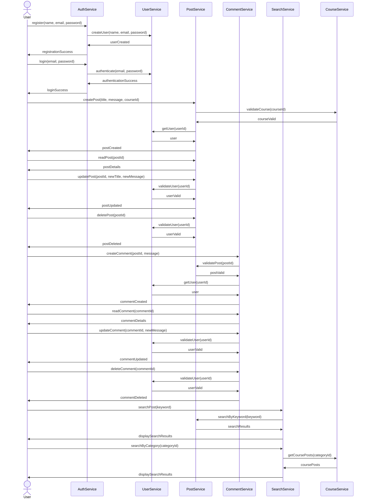

# Oracle One Forum Hub Challenger - Spring Boot

## Table of Contents
- [Introduction](#introduction)
- [Features](#features)
- [Diagrams](#diagrams)
- [Prerequisites](#prerequisites)
- [Installation](#installation)
- [Usage](#usage)
- [Configuration](#configuration)
- [Running Tests](#running-tests)
- [Contributing](#contributing)
- [License](#license)
- [Contact](#contact)

## Introduction
  The Oracle One Forum Hub Challenger is a Spring Boot application designed
  to serve as a forum hub. This project is a challenge by Oracle aimed at fostering
  learning and development among developers. The application allows users to create, 
  view, and participate in discussion threads.

## Features

 * User registration and authentication
 * Create, read, update, and delete (CRUD) operations for forum posts
 * Commenting system for posts
 * Categorization of posts by topics
 * Search functionality

## Diagrams
  Some Diagrams to clarify features.

### Entity Relationship Diagram 

  ```mermaid
  erDiagram
    USER {
        int id
        string name
        string email
        string password
    }
    
    PROFILE {
        int id
        string name
    }
    
    USER ||--|{ PROFILE: "profiles"
    
    COURSE {
        int id
        string name
        string category
    }
    
    TOPIC {
        int id
        string title
        string message
        datetime creationDate
        string status
    }
    
    TOPIC }o--|| USER: "author"
    TOPIC }o--|| COURSE: "course"
    
    REPLY {
        int id
        string message
        datetime creationDate
        boolean solution
    }
    
    REPLY }o--|| USER: "author"
    REPLY }o--|| TOPIC: "topic"
    
    TOPIC ||--|{ REPLY: "replies"
```

### Class Diagram





